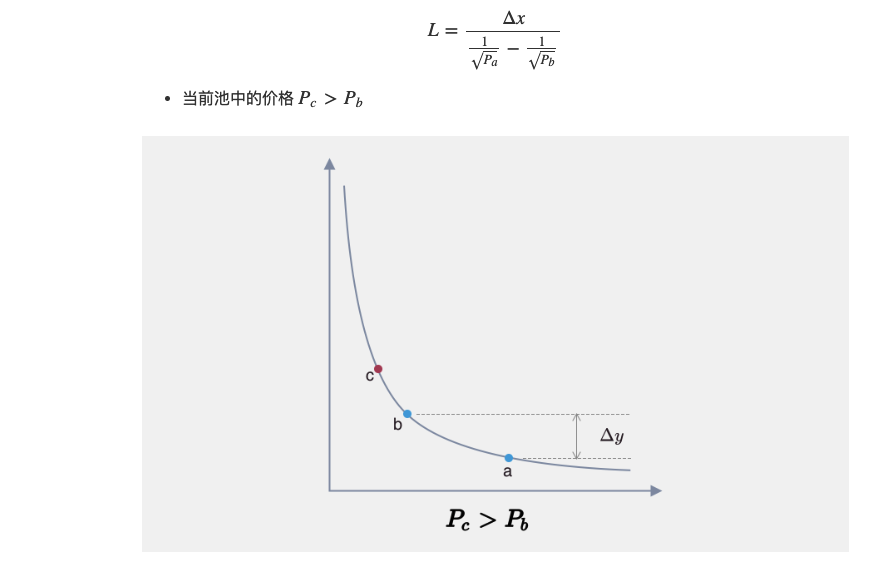
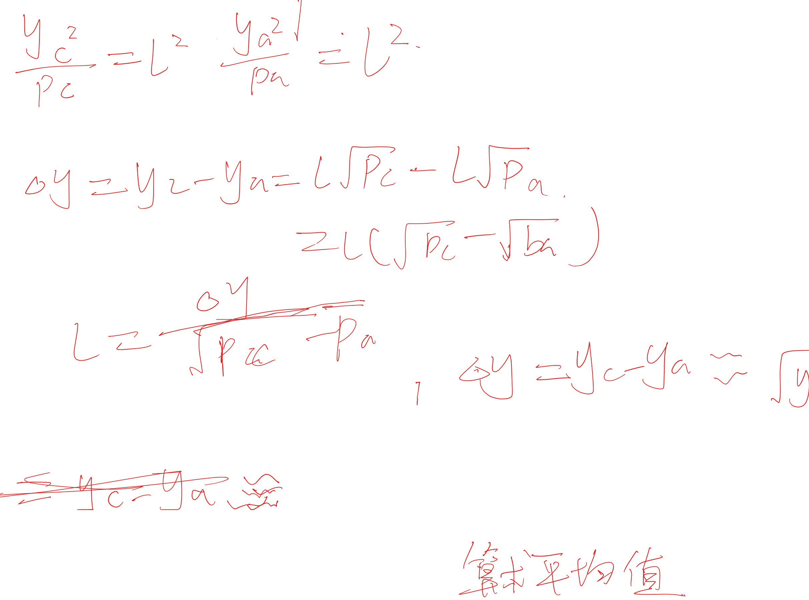
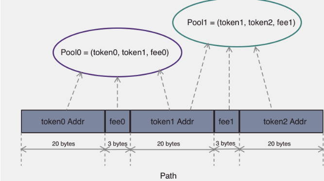

# 目录
1. amm改进
2. 创建交易对/提供流动性
3. 交易过程/手续费
4. oracle
5. 闪电贷

## amm改进, v3主要解决资金利用率的问题:
这是传统订单簿:

```
bid     0.1 v + 100000
...
```


这是uniswapV2
```
bid     0.1 v + 99000
        0.08 +9900
        0.07 +100
        0.06 +50
        0.0000000001   0.0000001
```


把这个平滑的曲线分段:
每一段都有特定的钱, 这个钱其实需要微积分来算, 因为价格是连续变化的

V3想做的就是传统订单簿的样子

bid     0.1 v + 100000


当价格变成0.2了,就移除0.1的那些流动性, 就相当于那部分订单就部分成交
变成

```
bid     0.2
bid     0.1 v + 99000
...
```

所以X*Y =k 这格式当前的流动性常数, 也可以认为是流动性lp的价格


所谓的流动性聚合 其实就是拆分像传统那样拆成离散的tick


靠上去 其实就是 你那流动性分段, 

(x+x1)*(y+y1) = k 


## 创建交易对
入口 createAndInitializePoolIfNecessary
使用create2 创建
查询addrss 不用交互
并且reloacate 的时候address 不变


## 提供流动性:
入口:
addliquidity


流动性计算:




下面就是代码:
主要是这句:
@dev Calculates amount0 * (sqrt(upper) * sqrt(lower)) / (sqrt(upper) 
用算数平均值来代替delta y
```c++

    /// @notice Computes the amount of liquidity received for a given amount of token0 and price range
    /// @dev Calculates amount0 * (sqrt(upper) * sqrt(lower)) / (sqrt(upper) - sqrt(lower))
    /// @param sqrtRatioAX96 A sqrt price representing the first tick boundary
    /// @param sqrtRatioBX96 A sqrt price representing the second tick boundary
    /// @param amount0 The amount0 being sent in
    /// @return liquidity The amount of returned liquidity
    function getLiquidityForAmount0(
        uint160 sqrtRatioAX96,
        uint160 sqrtRatioBX96,
        uint256 amount0
    ) internal pure returns (uint128 liquidity) {
        if (sqrtRatioAX96 > sqrtRatioBX96) (sqrtRatioAX96, sqrtRatioBX96) = (sqrtRatioBX96, sqrtRatioAX96);
        uint256 intermediate = FullMath.mulDiv(sqrtRatioAX96, sqrtRatioBX96, FixedPoint96.Q96);
        return toUint128(FullMath.mulDiv(amount0, intermediate, sqrtRatioBX96 - sqrtRatioAX96));
    }
```

修改position 实际上就是修改tickmap 中被引用的 tick 和该tick 下所有的持仓移除 没有用的(_updatePosition 中完成)


- token 数确认
在_modifyPosition 中完成


tick index 计算:
 log(sqrt(1.0001)*price)


## 交易过程
1. 前端算出路径 或者 交易预计算 
因为使用了分级的计算 所以前端算不出来, 必须链上计算 
使用swap函数必定异常  然后trycatch


2. 入口:
exactInput:
@ param path 
 路径中包含了交易过程中所有的 token，每相邻的两个 token 组成了一个交易对

 path紧凑的摆在bytes里:
 


单个池子的交易过程:

使用swap 
这个函数也可以完成闪电贷

- 交易分解:

swap 函数 计算下一个tick 需要的token数量 如果够得到下一个, 就说明流动性跨区域了
根据跨区域拆分token


手续费:

总的手续费


每个用户的流动性是position , position 有保存手续费 , 就在updateposition里面

每个tick 的总流动性 也有手续费 tick.update中


这个函数就是先用 pool.burn 函数来触发 pool 中 position 内手续费总额的更新
提取UniswapV3Pool.collect 提取手续费
